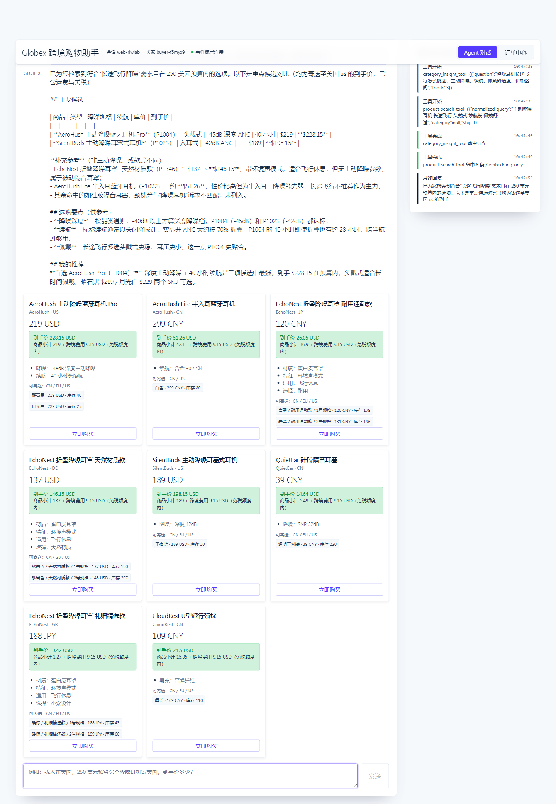
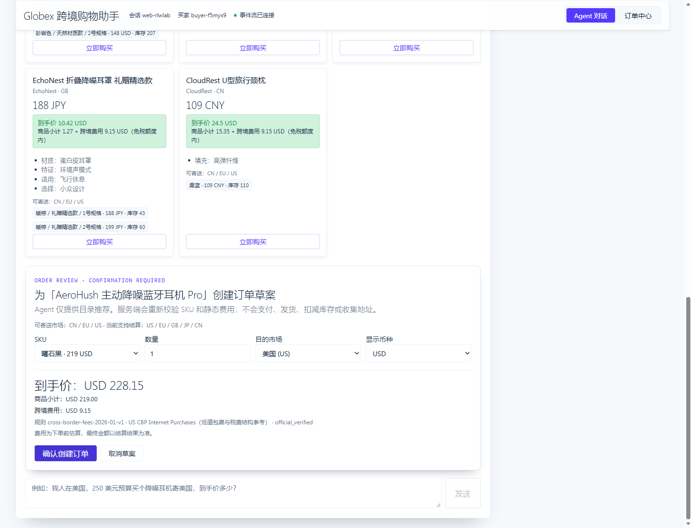
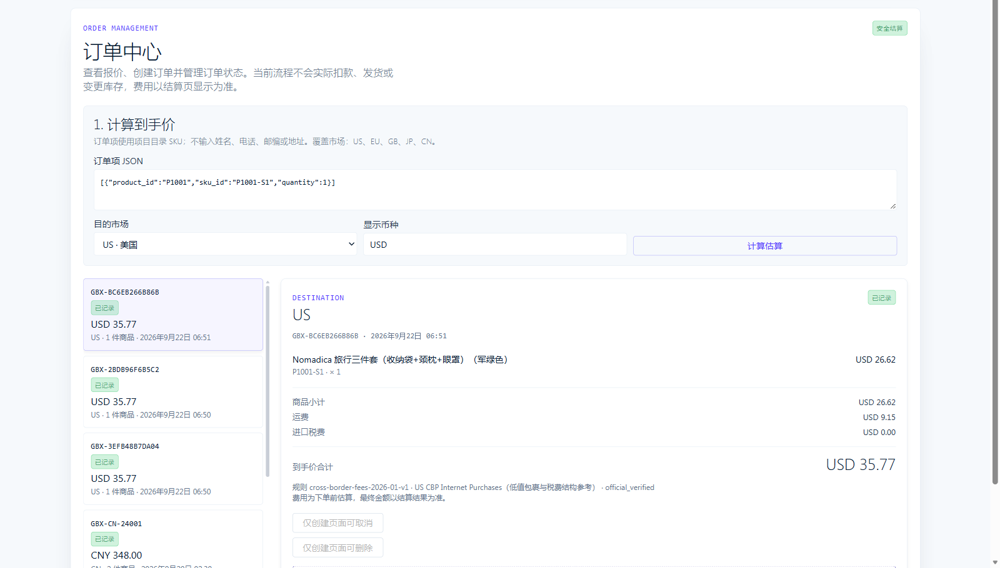

# Globex — 跨境购物智能体

用一句话说清目的市场、预算和偏好，Globex 会理解购物意图、检索商品、比较规格、计算到手价，并把合适的选择整理成可直接操作的商品卡。用户核对费用后，可在页面中创建和管理订单。

Globex 基于 AgentScope 2.x、FastAPI、SQLite、Redis、Qdrant、React 与 Vite 构建，可通过 Docker Compose 一键部署。它覆盖从自然语言找货、品类知识辅助决策、结构化商品推荐，到报价确认和订单管理的完整购物链路。

> **作者**：**jerry** ｜ 仓库：<https://github.com/scutjerry/gloshopping-agent>
>
> **当前服务范围**：页面支持商品检索、规格比较、跨币种费用估算、订单创建、取消与逻辑删除。当前版本未接入支付机构、承运商和外部履约系统，因此不会实际扣款、退款、发货或变更库存；费用以结算页显示为准。订单写操作必须由用户在页面中明确确认，Agent 不会代替用户提交。

---

## 产品体验

### 一次从询问到下单的完整链路

下面以“在美国、预算 250 美元、购买适合长途飞行的降噪耳机”为例。用户只需要描述目的市场、预算、使用场景和偏好，Globex 会完成需求理解、品类知识检索、商品召回、规格比较和到手价计算，并把推荐结果整理成可操作的商品卡。

> **用户**：我人在美国，预算 250 美元，想买一副适合长途飞行的降噪耳机。请比较合适的商品、规格和到手价。
>
> **Globex**：结合深度降噪、续航、佩戴方式和预算进行比较后，首选 AeroHush 主动降噪蓝牙耳机 Pro：`-45dB` 主动降噪、40 小时续航，到手价 `USD 228.15`；如果更偏好轻便入耳式，可选择 SilentBuds，到手价 `USD 198.15`。页面同时说明被目的市场过滤的候选以及推荐依据。

事件时间线会同步显示品类知识查询、商品搜索、召回结果和最终回复，用户可以看到 Agent 如何得到推荐结论。



### 从推荐商品进入订单核价

商品卡展示价格、到手价、跨境费用、商品亮点、规格库存和可寄送市场。点击首选商品的“立即购买”后，可以选择 SKU、数量、目的市场和显示币种；服务端重新核验商品信息并返回商品小计、跨境费用和到手价。



只有用户点击“确认创建订单”后才会提交订单。订单创建后可前往订单中心查看状态、商品明细和费用信息。

### 在订单中心查看和管理订单

订单中心提供报价入口、订单列表、状态、商品明细和费用拆分。用户可以管理当前页面创建的订单，公开响应不会返回买家身份、电话、邮编、详细地址或管理凭证。



---

## 核心能力

### 对话式商品检索

- **自然语言意图理解**：SearchAgent 将口语需求整理为目的市场、价格上限、品类意图和使用场景等检索规格。
- **二阶段召回与降级链**：`embedding_only` → `embedding_rerank` → `keyword_2gram`；响应中的 `recall_strategy` 如实反映实际路径。
- **硬过滤可观测**：被 `ship_to` 或价格上限排除的候选通过 `filtered_out` 返回摘要，便于解释结果。
- **结构化推荐卡**：展示商品、SKU、规格、价格、库存、到手价和可寄送市场，并衔接订单确认。
- **充足的检索纵深**：420 个 SPU、801 个 SKU、10 个品类；256 个商品提供多个 SKU，适合检验召回、过滤和排序差异。

### 品类知识增强

10 篇选购知识文档构成独立的 Qdrant 向量知识库。Agent 通过 `category_insight` 按需检索旅行装备、数码配件、户外运动、家居生活、健康护理、母婴亲子、宠物出行、办公文具、服饰配件和运动健身等主题，让推荐理由有可追溯的知识依据。

### 到手价与跨市场规则

- `POST /commerce/order-quotes` 提供无副作用报价；前端统一展示“跨境费用”，并与商品小计共同组成到手价。
- V1 版本化静态规则覆盖 `US`、`EU`、`GB`、`JP`、`CN` 五个市场。
- 报价会校验商品的 `ships_to`；不支持目标市场的商品不会进入确认流程。
- 金额在创建订单时冻结，后续详情保持同一费用快照。

### 订单管理与隐私

- **创建**：商品卡 → 订单确认 → 用户点击确认；`Idempotency-Key` 防止重复提交产生多笔订单。
- **取消**：仅允许管理当前页面创建且状态符合条件的订单。
- **逻辑删除**：保留订单行和幂等审计，将订单从公开列表隐藏，重复请求不会让已删除订单恢复。
- **最小化公开信息**：仅返回订单号、状态、金额、规则版本、时间、商品行和目的市场。
- **管理凭证保护**：凭证为一次性随机值，数据库仅保存 SHA-256 摘要；明文只驻留前端内存，不进入 localStorage、sessionStorage、URL 或日志。
- **Agent 权限边界**：Agent 只负责检索、比较和脱敏查询，不注册创建、取消或删除订单的工具。

### 长期偏好记忆

Agent 可以通过 `remember_preference` 与 `forget_preference` 维护跨会话的稳定偏好，并按当前问题的相关性筛选后注入上下文。

### 稳定性与可观测性

- 工具调用序列校验、循环检测和目标漂移检测按会话累积状态。
- 工具结果字符上限与上下文压缩避免大批商品 JSON 挤占模型上下文。
- 全进程共享模型并发和调用间隔限制，并为业务工具提供超时与熔断保护。
- 语义缓存键包含模型名和提示词文件指纹，更新模型或提示词后旧回复自动失效。
- WebSocket 实时推送模型输出、工具调用、计划和最终回答，前端将其呈现为事件时间线。
- Redis 为 API 与 worker 提供队列、缓存和跨进程事件背板；关键依赖不可用时按配置进入受控降级。

---

## 系统架构

```text
浏览器 http://localhost:8080
        │
        ▼
Nginx + React（frontend）
  ├── /                 React SPA
  ├── /api/*            → FastAPI app:8000
  └── /ws/*             → FastAPI WebSocket
        │
        ├── app          FastAPI + Agent + SQLite
        ├── worker       Redis Stream 意图消费
        ├── redis        缓存、队列与事件背板
        └── qdrant       商品与知识库向量索引
```

主要目录：

```text
app/
├── domain/              Product / SKU / Money / Order / 检索规格 / 仓储端口
├── application/
│   ├── agents/          主 Agent、检索与交易子 Agent、编排器、权限与上下文策略
│   ├── tools/           商品检索、品类洞察、订单查询、Web 搜索、偏好与子 Agent 派发
│   ├── harness/         序列校验、循环检测、漂移检测与工具契约断言
│   ├── memory/          偏好选择
│   ├── prompts/         Agent 提示词
│   └── usecases/        商品检索、报价与订单用例
├── infrastructure/      SQLite / Redis / Qdrant / 模型 / 缓存 / 韧性 / 目录数据
├── presentation/        FastAPI 路由、WebSocket 与脱敏 DTO
├── composition.py       API 与 worker 共用的装配根
└── worker.py            队列消费者入口
frontend/                React + Vite 源码和 Nginx 生产镜像
knowledge/               品类选购知识文档
scripts/                 本地运行、评测、压测与验证脚本
tests/                   领域、应用、基础设施和 HTTP 契约测试
docker/docker-compose.yaml
```

---

## 快速开始

### 1. 准备配置

```bash
cp .env.example .env
# 编辑 .env，至少配置：
# LLM_BASE_URL
# LLM_API_KEY
# LLM_MODEL
```

`.env` 是 app 与 worker 的唯一配置来源，通过 Compose 的 `env_file` 注入。不要把 API Key 提交到版本库。

### 2. 启动完整服务

```bash
docker compose --project-name globex \
  --env-file .env \
  -f docker/docker-compose.yaml \
  up -d --build
```

浏览器打开：**<http://localhost:8080>**

服务数据由以下命名卷持久化：

- `globex_app-data`
- `globex_redis-data`
- `globex_qdrant-data`

应用启动时会幂等同步商品目录和订单数据、构建 420 个商品向量，并刷新品类知识索引。

### 3. 检查状态

```bash
docker compose --project-name globex \
  --env-file .env \
  -f docker/docker-compose.yaml ps

curl http://localhost:8080/healthz
curl http://localhost:8080/api/health
```

只重建后端时使用 `--no-deps`，避免重建 Redis 和 Qdrant：

```bash
docker compose --project-name globex \
  --env-file .env \
  -f docker/docker-compose.yaml \
  up -d --build --no-deps app worker
```

---

## 本地开发

### 后端

```bash
uv sync
cp .env.example .env
uv run uvicorn app.presentation.server:app --port 8000
```

如启用 Redis 队列，另开终端运行：

```bash
uv run python -m app.worker
```

### 前端

```bash
cd frontend
npm ci
npm run dev
```

Vite 会把 `/api` 与 `/ws` 代理至 `http://localhost:8000`。

---

## Commerce API

```text
POST   /commerce/order-quotes                     计算到手价
POST   /commerce/orders                           创建订单（需要 Idempotency-Key）
POST   /commerce/orders/{order_id}/cancellations  取消订单
DELETE /commerce/orders/{order_id}                逻辑删除订单
GET    /commerce/orders?limit=1..50               获取订单列表
GET    /commerce/orders/{order_id}                获取订单详情
```

示例：

```bash
curl http://localhost:8080/api/commerce/orders
curl http://localhost:8080/api/commerce/orders/GBX-CN-24001

curl -X POST http://localhost:8080/api/commerce/order-quotes \
  -H "Content-Type: application/json" \
  -d '{"items":[{"product_id":"P1001","sku_id":"P1001-S1","quantity":1}],
       "destination_country":"US","currency":"USD"}'
```

商品卡只负责打开订单确认；服务端会重新校验 SKU、目的市场和费用。用户点击“确认创建订单”后才会提交创建请求。

---

## 质量验证

```bash
uv run pytest -q
cd frontend && npm run build
```

当前完整测试套件为 **342 passed**。前端生产构建执行 `tsc -b && vite build`，同时完成 TypeScript 类型检查和资源构建。

测试覆盖：

- 领域对象与金额规则
- 商品目录规模和检索排序回归
- 向量召回、rerank 和关键词降级
- 缓存、Redis 队列与跨进程事件流
- SQLite 仓储与启动幂等
- Agent 权限、序列护栏和上下文策略
- 报价、订单幂等、取消、逻辑删除与公开 DTO 隐私
- 用户可见文案与知识文档回归

评测与压测：

```bash
uv run python scripts/eval_regression.py
uv run python scripts/smoke_e2e.py
uv run python scripts/loadtest.py
# 或：uv run locust -f scripts/locustfile.py
```

---

## 服务边界

当前版本专注于购物决策、费用估算和订单管理。若用于生产交易，还需要接入并验证：

- 用户认证、授权与订单归属
- 收货地址和隐私合规
- 实时报价与库存预占
- 支付、退款和支付回调验签
- 仓储、承运商、物流追踪与售后
- 审计日志、数据保留和合规策略

现有一次性管理凭证、静态费用规则和订单写接口不应直接当作生产支付或履约能力使用。

---

## 相关文档

| 文档 | 内容 |
| --- | --- |
| [`docs/catalog-data-foundation.md`](docs/catalog-data-foundation.md) | 商品目录表结构、导入顺序与索引流程 |
| [`docs/embedding-rag-vectorrecord-incident.md`](docs/embedding-rag-vectorrecord-incident.md) | Embedding 网关与知识库写入故障复盘 |
| [`docs/MVP_READONLY_ORDERS.md`](docs/MVP_READONLY_ORDERS.md) | 订单能力与部署边界 |
| [`docs/agent-memory.md`](docs/agent-memory.md) | 项目约束、关键决策与交接记忆 |

---

## 作者

**jerry** — <https://github.com/scutjerry>
